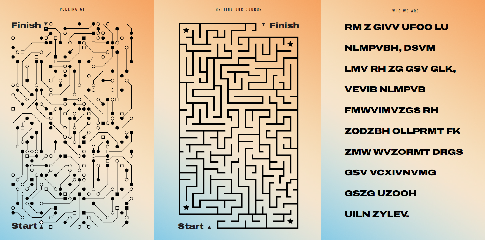

# Bienvenue sur mon github


```
 .--.       .-.         _                                       .-.               
: .--'      : :        :_;                                      : :               
`. `.  .--. : :  .-..-..-.,-.,-. .--.   .---. .-..-..---. .---. : :   .--.  .--.  
 _`, :' .; :: :_ : `; :: :: ,. :' .; :  : .; `: :; :`-'_.'`-'_.': :_ ' '_.'`._-.' 
`.__.'`.__.'`.__;`.__.':_;:_;:_;`._. ;  : ._.'`.__.'`.___;`.___;`.__;`.__.'`.__.' 
                                 .-. :  : :
                                 `._.'  :_;

                         _  .-. .-.      .--.  .--. .-.
                        :_;.' `.: :     : .--': ,. :: :
               .-..-..-..-.`. .': `-.   `. `. : :: :: :
               : `; `; :: : : : : .. :   _`, :: :;_:: :__
               `.__.__.':_; :_; :_;:_;  `.__.'`._:_;:___.'
```
Ce site est dédié à la résolution de puzzles en SQL. 
Je ne suis pas un dieu vivant du SQL, loin de là ! Alors si vous voyez des optimisations possibles dans le code, n'hésitez pas à les partager !
<br>
## Qui suis-je ? 

Renaud RIOUAL. Data analyst depuis... quelques années déjà. Je ne les compte plus pour pas me faire mal au moral !
<br>
Vous pouvez me trouver sur linkedin en [cliquant ici](www.linkedin.com/in/renaud-rioual)
<br>
<br>
## Quelques exemple de puzzles
Et voici en images le genre de puzzles que j'essayerai de résoudre ici ! 



