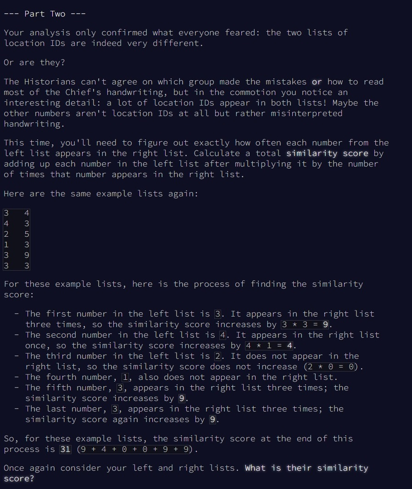

# Advent of Code - puzzle 1


## Input
Télécharger l'input du [Puzzle 1](https://github.com/renoriwal/puzzles/tree/main/adventofcode_2024/puzzle_1/puzzle_1_input.txt)

## Question 1


<br>
<br>

## Resolution Question 1

Code en lien [ici](https://github.com/renoriwal/puzzles/tree/main/adventofcode_2024/puzzle_1/puzzle_1_question_1_resolution_sql.sql).
<br> ou tout simplement ici : 
```sql
/*
 script : 
 résolution de la question 1 du puzzle : https://adventofcode.com/2024/day/1  

 résumé : 
 on a 2 colonnes. Il faut faire matcher les valeurs des colonnes pour que : 
                  - la valeur la plus petite de la colonne 1 soit associée à la valeur la plus petite de la colonne 2
                  - la 2ème valeur la plus petite de la colonne 1 soit associée à la 2ème valeur la plus petite de la colonne 2
                  - .........
                  - la valeur la plus grande de la colonne 1 soit associée à la 2ème valeur la plus grande de la colonne 2
 une fois que le match est fait, il faut sommer la différence entre les deux colonnes. 
 Attention, la différence doit toujours être positive (valeur la plus grande retranchée de la valeur l aplus petite
*/

with 
DATA_PREP as 
-- préparation des données : séparation des colonnes. un substring classique suffit car la longueur de chaîne de caractère est toujours la même
(
select 
     cast(substring(T.data,1,5           ) as integer) as col_1
    ,cast(substring(T.data,6,length(data)) as integer) as col_2
from PROJET.SCHEMA.TABLE_PUZZLE as T
)
,DATA_PREP_ENRICHIE as 
-- Enrichissement de la table avec le rank sur chacune des colonnes. Permettra de faire la jointure entre col1 et col2 dans l'ordre asc des données
(
select
    DATA_PREP.col_1
   ,DATA_PREP.col_2
   ,row_number() over (order by DATA_PREP.col_1) as rk_col_1
   ,row_number() over (order by DATA_PREP.col_2) as rk_col_2
from DATA_PREP
)
-- Dernier calcul : jointure sur le rank : permet de confronter : la plus petite valeur de la colonne 1 avec la plus petite de la colonne 2,
--                                               la 2eme plus petite de la colonne 1 avec la 2ieme plus petite de la colonne 2
--                                               ..............................................................................
--                                               la plus grande valeur de la colonne 1 avec la plus grande valeur de la colonne 2.
-- il ne reste plus qu'à calculer la différence de ces valeurs et de sommer : 
select 
    sum(abs(C1.col_1 - C2.col_2)) as reponse_puzzle_1_question_1 -- la valeur absolue permet de ne sommer que des chiffres positifs
from DATA_PREP_ENRICHIE as C1
join DATA_PREP_ENRICHIE as C2 
    on C1.rk_col_1 = C2.rk_col_2

```

<br>
<br>

## Question 2


<br>
Résolution En [SQL](https://github.com/renoriwal/puzzles/tree/main/adventofcode_2024/puzzle_1/puzzle_1_question_2_resolution_sql.sql)


<br>
<br>

## Resolution Question 2


Code en lien [ici](https://github.com/renoriwal/puzzles/tree/main/adventofcode_2024/puzzle_1/puzzle_1_question_2_resolution_sql.sql).
<br> ou tout simplement ici : 
```sql

/*
 script : 
 résolution de la question 2 du puzzle : https://adventofcode.com/2024/day/1  

résumé :
Pour chaque valeur différente de la première colonne 1 par le nombre de fois qu'apparît ce nombre dans la colonne 2, puis on somme la totalité.  
*/

with 
DATA_PREP as 
-- préparation des données : séparation des colonnes. un substring classique suffit car la longueur de chaîne de caractère est toujours la même
(
select 
     cast(substring(T.data,1,5           ) as integer) as col_1
    ,cast(substring(T.data,6,length(data)) as integer) as col_2
from PROJET.SCHEMA.TABLE_PUZZLE as T
)
,COMPTAGE as 
(
select
     C1.col_1
    ,count(*) as nb_apparition
from DATA_PREP C1
join DATA_PREP C2
    on C1.col_1 = C2.col_2
group by all
)
select 
    sum(COMPTAGE.col_1 * COMPTAGE.nb_apparition) as reponse_puzzle_1_question_2
from COMPTAGE
```