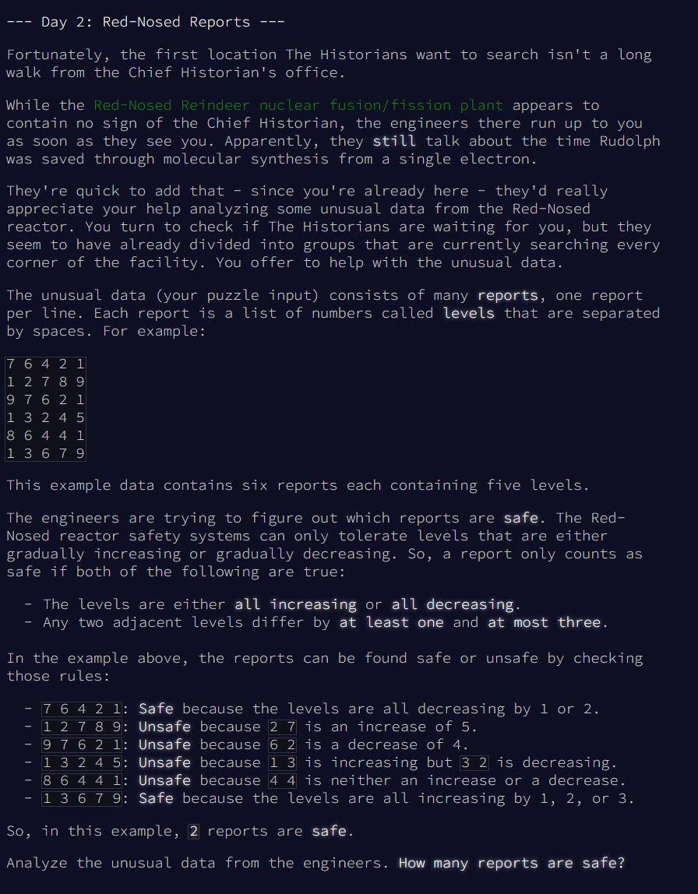
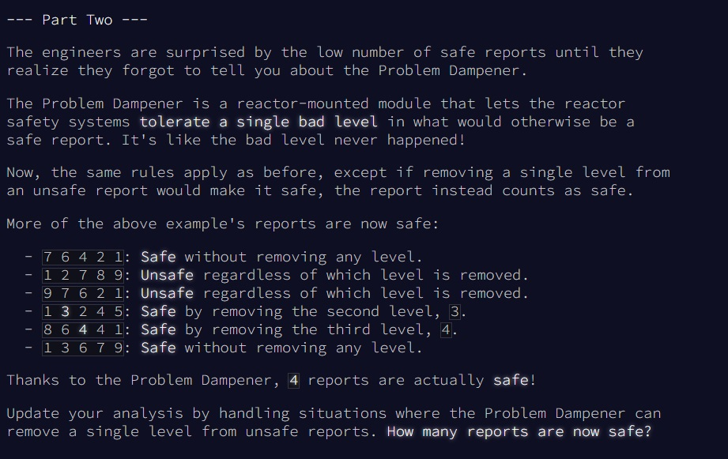

# Advent of Code - puzzle 2

Le puzzle se trouve en ligne [ici](https://adventofcode.com/2024/day/2).

## Question 1


<br>
<br>

## Difficultés rencontrées

La question 1 reste assez simple. La seule difficultés c'est l'intégration des données et de voir comment transformer cela en table requêtable. 
<br>
Pour la question 2, il fallait réfléchir un peu plus. je ne voulais surtout pas créer toutes les séries possibles en faisant 8 union (8 = max de valeur dans une série) et pour chaque union j'enlève l'une des valeur. Le code aurait été trop moche. Le join sur la table elle-même fonctionne très bien, mais je dois avouer que je me suis tromper 2 fois sur le résultat avant de trouver la solution. Le filtre que j'appliquais pour enlever une seule valeur pour chaque série n'était pas bon... 

## Resolution Question 1

Code en lien [ici](https://github.com/renoriwal/puzzles/tree/main/adventofcode_2024/puzzle_2/puzzle_2_question_2_resolution_sql.sql).
<br> ou tout simplement ci-dessous. Le code a été exécuté sous BigQuery : 
```sql

--
-- script : 
-- résolution de la question 2 du puzzle : https://adventofcode.com/2024/day/2
-- traitée sur bigquery
--
-- résumé : 
-- on calcul la différence entre la valeur actuel et la valeur précédente. 
-- la différence doit toujours être comprise entre 1 et 3 et la série doittoujours être strictement croissante ou strictement décroissante
-- 


with DATA_SPLIT as 
-- split des données pour obtenir un array
(
select 
     col_0 as serie
    ,split(col_0,' ') as data_split
from PROJET.SCHEMA.PUZZLE_INPUT
)
,DATA_PREP as 
-- pivot sur l'array pour obtenir une ligne par valeur. On rajoute le rank pour bien garder l'ordre
(
select 
     serie
    ,cast(DATA_UNNEST as integer) as valeur
    ,row_number() over (partition by serie) as rank
from DATA_SPLIT
left join unnest(DATA_SPLIT.data_split) DATA_UNNEST
)
,DATA_DIFF as 
-- maintenant que les données sont bien formatées, on commence à les travailler. le but sera de créer les colonnes qui permettront de filtrer selon les reègles du jeu
-- on calcule la différence entre la ligne actuel et la ligne précédente.
(
select 
     serie
    ,valeur
    ,rank
    ,valeur - lag(valeur) over (partition by serie order by rank) as diff
from DATA_PREP
)
,DATA_DIFF_ENRICHIE as 
-- on calcule les colonnes qui permettront de filtrer sur les règles imposées : 
-- ecart_min_entre_2_valeurs et ecart_max_entre_2_valeurs permet de vérifier qu'entre deux valeurs, on a bien un écart entre 1 et 3
-- ecart_min, ecart_max permettront de vérifier que la série est soit strictement croissante soit strictement décroissante
(
select 
     serie
    ,valeur
    ,rank
    ,diff
    ,min(abs(diff)) over (partition by serie) as ecart_min_entre_2_valeurs
    ,max(abs(diff)) over (partition by serie) as ecart_max_entre_2_valeurs
    ,min(    diff ) over (partition by serie) as ecart_min
    ,max(    diff ) over (partition by serie) as ecart_max
from DATA_DIFF
)
-- il ne reste qu'à filtrer sur les bonnes séries et à les compter
select 
     count(distinct serie) as reponse_puzzle_2_question_1
from DATA_DIFF_ENRICHIE
where true
    and diff is not null -- élimination de la première ligne de chaque série qui n'a plus rien a apporter
    and ecart_min_entre_2_valeurs between 1 and 3 -- règle : entre 1 et 3 d'écart entre 2 valeurs
    and ecart_max_entre_2_valeurs between 1 and 3 -- règle : entre 1 et 3 d'écart entre 2 valeurs
    and ecart_min * ecart_max > 0 -- règle : série strictement croissante ou décroissante
```

<br>
<br>

## Question 2


<br>
Résolution En [SQL](https://github.com/renoriwal/puzzles/tree/main/adventofcode_2024/puzzle_2/puzzle_2_question_2_resolution_sql.sql)


<br>
<br>

## Resolution Question 2


Code en lien [ici](https://github.com/renoriwal/puzzles/tree/main/adventofcode_2024/puzzle_2/puzzle_2_question_2_resolution_sql.sql).
<br> ou tout simplement ici : 
```sql

--
-- script : 
-- traitée sur bigquery
--
-- 
-- 2eme question : 
-- on autorise une valeur corrompue dans la série. si sans cette valeur la série est bonne, alors on la compte. 
--
-- pour se simplifier la tâche, on va recréer toutes les séries possibles en enlevant une seule valeurs à chaque fois.
-- Il restera qu'à appliquer à nouveau l'algo déjà fait à la question 1
--


with DATA_SPLIT as 
-- split des données pour obtenir un array
(
select 
     col_0 as serie
    ,split(col_0,' ') as data_split
from PROJET.SCHEMA.PUZZLE_INPUT
)
,DATA_PREP as 
-- pivot sur l'array pour obtenir une ligne par valeur. On rajoute le rank pour bien garder l'ordre
(
select 
     serie
    ,cast(DATA_UNNEST as integer) as valeur
    ,row_number() over (partition by serie) as rank
from DATA_SPLIT
left join unnest(DATA_SPLIT.data_split) DATA_UNNEST
)
,ALL_SERIES as 
-- calcul de toutes les séries possibles en enlevant une des valeurs pour chaque série
-- pour cela : join de la table avec elle-même pour créer autant de série qu'on a de valeur dans la série + on rajoute le filtre pour enlever une valeur différente dans chaque série dupliquée
(
select 
     DATA_PREP.serie
    ,DATA_PREP.valeur
    ,DATA_PREP.rank
    ,DATA_FOR_MISSING_VALUE.valeur as valeur_manquante -- il s'agit de la valeur que l'on va retirer de la série. 
    ,DATA_FOR_MISSING_VALUE.rank as rang_valeur_manquante
from DATA_PREP 
join DATA_PREP as DATA_FOR_MISSING_VALUE
    on DATA_PREP.serie = DATA_FOR_MISSING_VALUE.serie
where true
    and not (DATA_FOR_MISSING_VALUE.valeur = DATA_PREP.valeur and DATA_FOR_MISSING_VALUE.rank = DATA_PREP.rank) -- on retire une valeur pour chaque série. 
)
-- à partir de là, il suffit d'appliquer l'algo précédent sur toute les séries. Il faut penser à changer les partition by des fonction analytics en y ajoutant la colonne "valeur_manquante"
,DATA_DIFF as 
-- maintenant que les données sont bien formatées, on commence à les travailler. le but sera de créer les colonnes qui permettront de filtrer selon les reègles du jeu
-- on calcule la différence entre la ligne actuel et la ligne précédente.
(
select 
     serie
    ,valeur
    ,rank
    ,valeur_manquante
    ,rang_valeur_manquante
    ,valeur - lag(valeur) over (partition by serie, valeur_manquante, rang_valeur_manquante order by rank) as diff
from ALL_SERIES
)
,DATA_DIFF_ENRICHIE as 
-- on calcule les colonnes qui permettront de filtrer sur les règles imposées : 
-- ecart_min_entre_2_valeurs et ecart_max_entre_2_valeurs permet de vérifier qu'entre deux valeurs, on a bien un écart entre 1 et 3
-- ecart_min, ecart_max permettront de vérifier que la série est soit strictement croissante soit strictement décroissante
(
select 
     serie
    ,valeur
    ,rank
    ,valeur_manquante
    ,diff
    ,min(abs(diff)) over (partition by serie, valeur_manquante, rang_valeur_manquante) as ecart_min_entre_2_valeurs
    ,max(abs(diff)) over (partition by serie, valeur_manquante, rang_valeur_manquante) as ecart_max_entre_2_valeurs
    ,min(    diff ) over (partition by serie, valeur_manquante, rang_valeur_manquante) as ecart_min
    ,max(    diff ) over (partition by serie, valeur_manquante, rang_valeur_manquante) as ecart_max
from DATA_DIFF
)
-- il ne reste qu'à filtrer sur les bonnes séries et à les compter
select 
     count(distinct serie) as reponse_puzzle_2_question_2
from DATA_DIFF_ENRICHIE
where true
    and diff is not null -- élimination de la première ligne de chaque série qui n'a plus rien a apporter
    and ecart_min_entre_2_valeurs between 1 and 3 -- règle : entre 1 et 3 d'écart entre 2 valeurs
    and ecart_max_entre_2_valeurs between 1 and 3 -- règle : entre 1 et 3 d'écart entre 2 valeurs
    and ecart_min * ecart_max > 0 -- règle : série strictement croissante ou décroissante

```