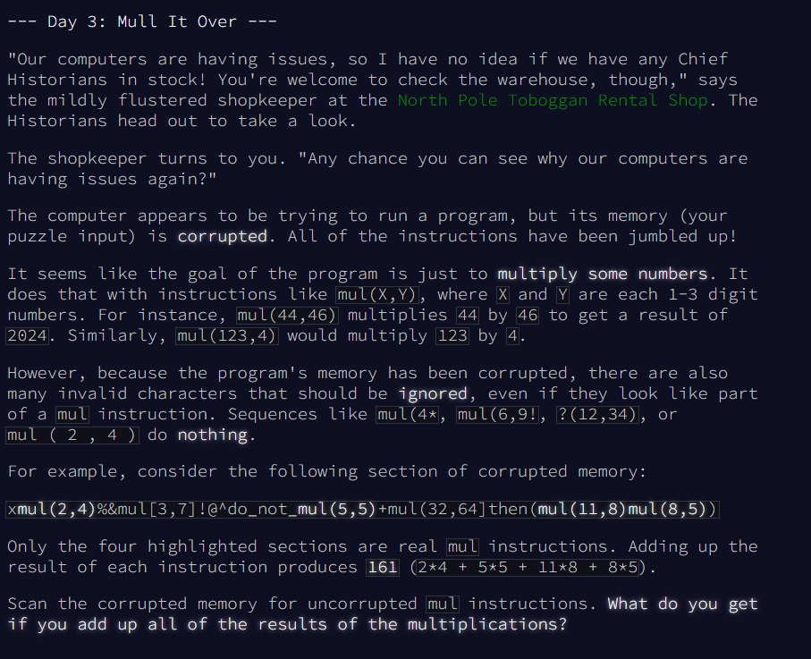
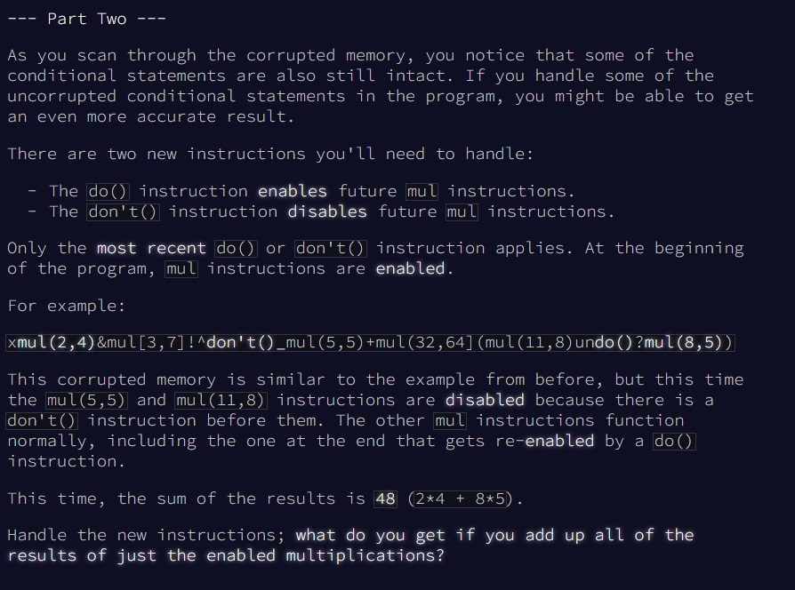

# Advent of Code - puzzle 3

Le puzzle se trouve en ligne [ici](https://adventofcode.com/2024/day/3).

## Question 1


<br>
<br>

## Difficultés rencontrées

1. Question 1 : Bien utilisé les expression régulière. Notamment, j'avais écris (\d+) pour prendre autant de chiffre qu'il y en avait à la suite, mais sur bigquery, je ne pouvais pas en mettre plus d'un dans la même expression régulière alors qu'il m'en faut deux (un pour trouver le premier paramètre du "mul" et un autre pour trouver le deuxième paramètre). Mais en le remplaçant par [0-9] tout fonctionne bien
2. Question 2 :  j'avais mis un coalesce au lieu d'un case when, sauf que le substring ne renvoie pas une valeur nulle s'il n'a rien à extraire mais il renvoie un string vide. j'ai mis une heure à m'en rendre compte

## Solution Question 1

Code en lien [ici](https://github.com/renoriwal/puzzles/tree/main/adventofcode_2024/puzzle_3/puzzle_3_question_1_solution_sql.sql).
<br> ou tout simplement ci-dessous :
```sql
with DATA_SPLIT as 
-- split des données pour obtenir un array
(
select 
     col_0 as data
    ,regexp_extract_all(col_0, r'mul\([0-9]+,[0-9]+\)')  as all_mul
from PROJET.SCHEMA.PUZZLE_INPUT
)
,DATA_UNNEST as 
(
select 
    mul
from DATA_SPLIT
join unnest (DATA_SPLIT.all_mul) as mul
)
,DATA_EXTRACT_ELEMENT as 
(
select 
     mul
    ,substring(mul,5               ,instr(mul,',')-5                ) as element_1 -- extraction du premier  élément
    ,substring(mul,instr(mul,',')+1,(length(mul) - instr(mul,','))-1) as element_2 -- extraction du deuxième élément
from DATA_UNNEST
)
select 
sum(cast(element_1 as integer)*cast(element_2 as integer))
from DATA_EXTRACT_ELEMENT
```


## Question 2


<br>


## Solution Question 2


Code en lien [ici](https://github.com/renoriwal/puzzles/tree/main/adventofcode_2024/puzzle_3/puzzle_3_question_2_solution_sql.sql).
<br> ou tout simplement ici : 
```sql

with DATA_CONCAT as
-- on retravaille la data qui était sur 6 lignes pour tout avoir en seul bloc : 
(
select
     string_agg(col_0,'') as data
from PROJET.SCHEMA.PUZZLE_INPUT
)
,DATA_SPLIT_DO as 
-- split des données pour obtenir un array
-- le but est d'utiliser l'instruction do() comme séparateur. on pourra ainsi compter tous les mul car ils seront valides, et on s'arrêtera au premier "don't() trouvé
(
select 
     data
    ,split(data,'do()') as value
from DATA_CONCAT
)
,DATA_UNNEST_DO as 
-- pivot sur l'array pour obtenir une ligne par valeur.
(
select 
     data
    ,DATA_UNNEST as value
from DATA_SPLIT_DO
left join unnest(DATA_SPLIT_DO.value) DATA_UNNEST
)
,DATA_FILTRE_DO as
-- on extrait la donnée jusqu'au premier "don't()" que l'on trouve. s'il n'y en a pas, on prend toute la valeur.
-- en faisant cela, on récupère bien la donnée qui est après un "do()" (on garde aussi le début du dataset même s'il ne commence pas par "do()" et qui est avant un "don't()"
(
select 
     case when instr(value,'don\'t()') = 0 then value else substring(value, 1, instr(value,'don\'t()')) end as value
from DATA_UNNEST_DO
)
-- à partir de ce moment, il suffit de refaire tourner l'algo créé précédemment :
,DATA_SPLIT as 
-- split des données pour obtenir un array
(
select 
     value as data
    ,regexp_extract_all(value, r'mul\([0-9]+,[0-9]+\)')  as all_mul
from DATA_FILTRE_DO
)
,DATA_UNNEST as 
(
select 
    mul
from DATA_SPLIT
join unnest (DATA_SPLIT.all_mul) as mul
)
,DATA_EXTRACT_ELEMENT as 
(
select 
     mul
    ,substring(mul,5               ,instr(mul,',')-5                ) as element_1 -- extraction du premier  élément
    ,substring(mul,instr(mul,',')+1,(length(mul) - instr(mul,','))-1) as element_2 -- extraction du deuxième élément
from DATA_UNNEST
)
select 
sum(cast(element_1 as integer)*cast(element_2 as integer))
from DATA_EXTRACT_ELEMENT

```