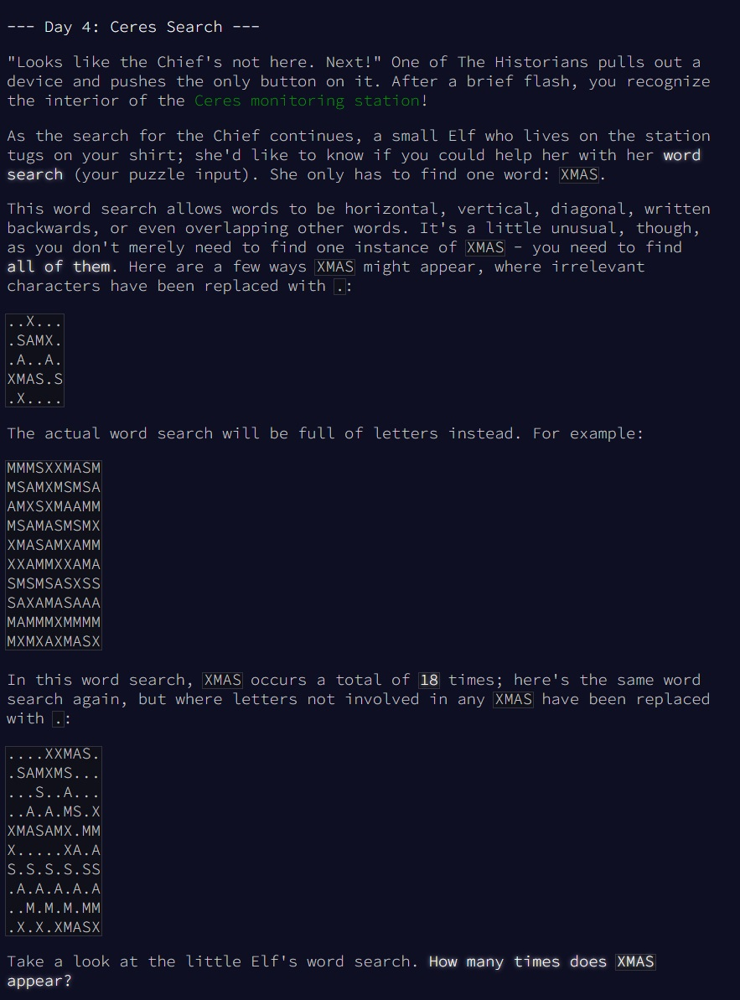
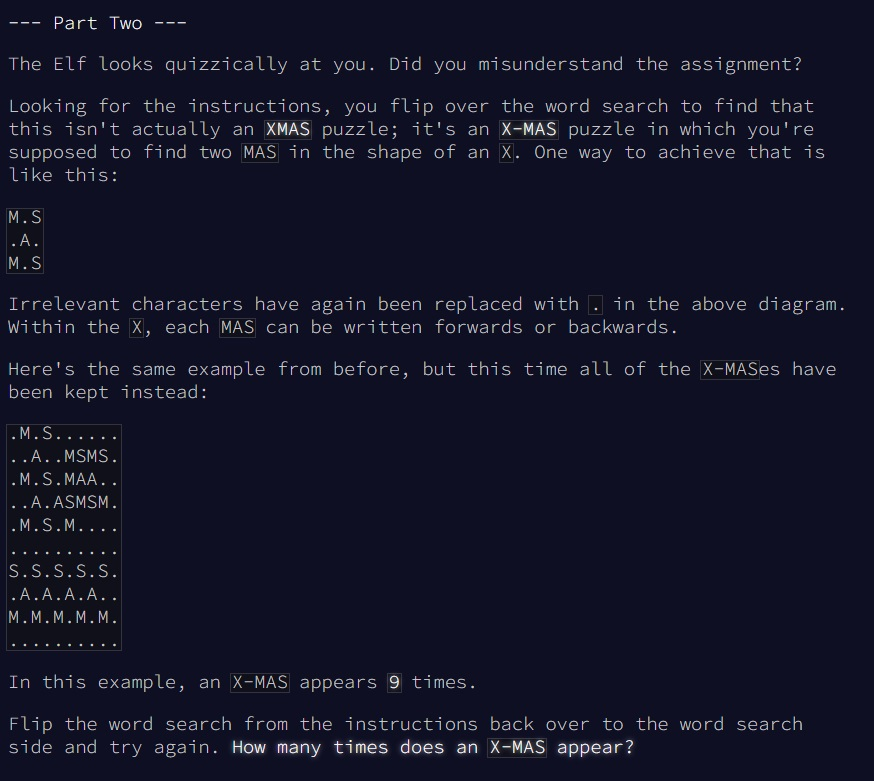

# Advent of Code - puzzle 4

Le puzzle se trouve en ligne [ici](https://adventofcode.com/2024/day/4).

## Question 1


<br>
<br>

## Difficultés rencontrées

1. Question 1 : Comment traiter la donnée. je pensais la lire d'un bloc, rechercher les XMAS avec un regexp. ça aurait bien marché sur les xmas horizontaux. Pour les Verticaux, je pensais pivoter la table, mais il fallait créer autant de lignes que de caractères, ça devenait l'enfer. Du coup j'ai opté pour donner des coordonnées pour chaque caractère pour les repérer dans une "grille"
2. Question 2 :  pas de difficulté une fois la question 1 répondue. il fallait juste changer un peu les jointures. 
<br>
Au final, le code est un peu rébarbatif mais il répond bien à la question. 

## Solution Question 1

Code en lien [ici](https://github.com/renoriwal/puzzles/tree/main/adventofcode_2024/puzzle_4/puzzle_4_question_1_solution_sql.sql).
<br> ou tout simplement ci-dessous :
```sql
with DATA_CONCAT as
-- on rajoute un rank pour être sûr de travailler la donnée dans le bon ordre. le rank est sur les lignes. 
(
select
     col_0 as ligne
    ,row_number() over () as rank_ligne
from PROJET.SCHEMA.PUZZLE_INPUT
)
,DATA_SPLIT as 
-- on split pour séparer tous les caractères 1 par 1. On rajoute le rank pour être sûr de garder l'ordre des colonnes. 
(
select 
     ligne
    ,rank_ligne
    ,split(ligne,'') as value
from DATA_CONCAT
)
,DATA_UNNEST as 
-- pivot sur l'array pour obtenir une ligne par caractère. les colonnes rank_ligne et rank_colonne permettent maintenant d'obtenir la position exacte du caractère
-- cela donne en quelque sorte une matrice que l'on manipulera à notre guise. 
(
select 
     ligne
    ,rank_ligne
    ,row_number() over (partition by ligne) as rank_colonne
    ,DATA_UNNEST as value
from DATA_SPLIT
left join unnest(DATA_SPLIT.value) DATA_UNNEST
)
-- à partir de maintenant, il n'y a plus qu'à créer toutes les combinaisons possibles de 4 lettres : 
-- 1 : horizontalement, de gauche à droite
-- 2 : verticalement, de haut en bas
-- 3 : diagonalement, de gauche à droite et de bas en haut
-- 4 : diagonalement, de gauche à droite et de haut en bas
-- pour rechercher le mot "XMAS" dans les autres sens, on recherchera juste le mot "SAMX" dans les 4 opérations citées ci-dessus
-- 
-- les 4 tables contenant tous les mots possibles : 
,XMAS_HORIZONTAL as 
(
select 
     LETTRE_1.ligne
    ,LETTRE_1.rank_ligne
    ,LETTRE_1.rank_colonne
    ,LETTRE_1.value
    ,LETTRE_1.value as lettre_1
    ,LETTRE_2.value as lettre_2
    ,LETTRE_3.value as lettre_3
    ,LETTRE_4.value as lettre_4
from DATA_UNNEST as LETTRE_1
left join DATA_UNNEST as LETTRE_2
    on  LETTRE_1.rank_ligne   = LETTRE_2.rank_ligne
    and LETTRE_1.rank_colonne = LETTRE_2.rank_colonne - 1
left join DATA_UNNEST as LETTRE_3
    on  LETTRE_1.rank_ligne   = LETTRE_3.rank_ligne
    and LETTRE_1.rank_colonne = LETTRE_3.rank_colonne - 2
left join DATA_UNNEST as LETTRE_4
    on  LETTRE_1.rank_ligne   = LETTRE_4.rank_ligne
    and LETTRE_1.rank_colonne = LETTRE_4.rank_colonne - 3
)
,XMAS_VERTICAL as 
(
select 
     LETTRE_1.ligne
    ,LETTRE_1.rank_ligne
    ,LETTRE_1.rank_colonne
    ,LETTRE_1.value
    ,LETTRE_1.value as lettre_1
    ,LETTRE_2.value as lettre_2
    ,LETTRE_3.value as lettre_3
    ,LETTRE_4.value as lettre_4
from DATA_UNNEST as LETTRE_1
left join DATA_UNNEST as LETTRE_2
    on  LETTRE_1.rank_ligne   = LETTRE_2.rank_ligne - 1
    and LETTRE_1.rank_colonne = LETTRE_2.rank_colonne
left join DATA_UNNEST as LETTRE_3
    on  LETTRE_1.rank_ligne   = LETTRE_3.rank_ligne - 2
    and LETTRE_1.rank_colonne = LETTRE_3.rank_colonne
left join DATA_UNNEST as LETTRE_4
    on  LETTRE_1.rank_ligne   = LETTRE_4.rank_ligne - 3
    and LETTRE_1.rank_colonne = LETTRE_4.rank_colonne
)
,XMAS_DIAGONAL_HAUT as 
(
select 
     LETTRE_1.ligne
    ,LETTRE_1.rank_ligne
    ,LETTRE_1.rank_colonne
    ,LETTRE_1.value
    ,LETTRE_1.value as lettre_1
    ,LETTRE_2.value as lettre_2
    ,LETTRE_3.value as lettre_3
    ,LETTRE_4.value as lettre_4
from DATA_UNNEST as LETTRE_1
left join DATA_UNNEST as LETTRE_2
    on  LETTRE_1.rank_ligne   = LETTRE_2.rank_ligne + 1
    and LETTRE_1.rank_colonne = LETTRE_2.rank_colonne - 1
left join DATA_UNNEST as LETTRE_3
    on  LETTRE_1.rank_ligne   = LETTRE_3.rank_ligne + 2
    and LETTRE_1.rank_colonne = LETTRE_3.rank_colonne - 2
left join DATA_UNNEST as LETTRE_4
    on  LETTRE_1.rank_ligne   = LETTRE_4.rank_ligne + 3
    and LETTRE_1.rank_colonne = LETTRE_4.rank_colonne - 3
)
,XMAS_DIAGONAL_BAS as 
(
select 
     LETTRE_1.ligne
    ,LETTRE_1.rank_ligne
    ,LETTRE_1.rank_colonne
    ,LETTRE_1.value
    ,LETTRE_1.value as lettre_1
    ,LETTRE_2.value as lettre_2
    ,LETTRE_3.value as lettre_3
    ,LETTRE_4.value as lettre_4
from DATA_UNNEST as LETTRE_1
left join DATA_UNNEST as LETTRE_2
    on  LETTRE_1.rank_ligne   = LETTRE_2.rank_ligne - 1
    and LETTRE_1.rank_colonne = LETTRE_2.rank_colonne - 1
left join DATA_UNNEST as LETTRE_3
    on  LETTRE_1.rank_ligne   = LETTRE_3.rank_ligne - 2
    and LETTRE_1.rank_colonne = LETTRE_3.rank_colonne - 2
left join DATA_UNNEST as LETTRE_4
    on  LETTRE_1.rank_ligne   = LETTRE_4.rank_ligne - 3
    and LETTRE_1.rank_colonne = LETTRE_4.rank_colonne - 3
)
,UNION_ALL as 
-- on récupère tous les mots possibles des 4 tables : 
(
select lettre_1||lettre_2||lettre_3||lettre_4 as mot from XMAS_HORIZONTAL    union all
select lettre_1||lettre_2||lettre_3||lettre_4 as mot from XMAS_VERTICAL      union all
select lettre_1||lettre_2||lettre_3||lettre_4 as mot from XMAS_DIAGONAL_HAUT union all
select lettre_1||lettre_2||lettre_3||lettre_4 as mot from XMAS_DIAGONAL_BAS  
)
-- il ne reste plus qu'à compter le nombre de fois qu'apparaît "XMAS" et "SAMX"
select 
    count(*)
from UNION_ALL
where mot in ('XMAS','SAMX')
```


## Question 2


<br>


## Solution Question 2


Code en lien [ici](https://github.com/renoriwal/puzzles/tree/main/adventofcode_2024/puzzle_4/puzzle_4_question_2_solution_sql.sql).
<br> ou tout simplement ici : 
```sql

with DATA_CONCAT as
-- on rajoute un rank pour être sûr de travailler la donnée dans le bon ordre. le rank est sur les lignes. 
(
select
     col_0 as ligne
    ,row_number() over () as rank_ligne
from PROJET.SCHEMA.PUZZLE_INPUT
)
,DATA_SPLIT as 
-- on split pour séparer tous les caractères 1 par 1. On rajoute le rank pour être sûr de garder l'ordre des colonnes. 
(
select 
     ligne
    ,rank_ligne
    ,split(ligne,'') as value
from DATA_CONCAT
)
,DATA_UNNEST as 
-- pivot sur l'array pour obtenir une ligne par caractère. les colonnes rank_ligne et rank_colonne permettent maintenant d'obtenir la position exacte du caractère
-- cela donne en quelque sorte une matrice que l'on manipulera à notre guise. 
(
select 
     ligne
    ,rank_ligne
    ,row_number() over (partition by ligne) as rank_colonne
    ,DATA_UNNEST as value
from DATA_SPLIT
left join unnest(DATA_SPLIT.value) DATA_UNNEST
)
-- on cherche à calculer les croix formées par le mot MAS. 
-- il y a 4 possibilités : les M sont à gauche, à droite, en haut ou en bas. 
-- les 4 tables contenant les croix  : 
,X_BAS as -- les "M" sont en bas
(
select 
     LETTRE_A.ligne
    ,LETTRE_A.rank_ligne
    ,LETTRE_A.rank_colonne
    ,LETTRE_A.value
    ,LETTRE_A.value  as lettre_a
    ,LETTRE_M1.value as lettre_m1
    ,LETTRE_M2.value as lettre_m2
    ,LETTRE_S1.value as lettre_s1
    ,LETTRE_S2.value as lettre_s2
from DATA_UNNEST as LETTRE_A
join DATA_UNNEST as LETTRE_M1
    on  LETTRE_A.rank_ligne   = LETTRE_M1.rank_ligne - 1
    and LETTRE_A.rank_colonne = LETTRE_M1.rank_colonne - 1 -- bas droit
    and LETTRE_M1.value = 'M'
join DATA_UNNEST as LETTRE_M2
    on  LETTRE_A.rank_ligne   = LETTRE_M2.rank_ligne - 1
    and LETTRE_A.rank_colonne = LETTRE_M2.rank_colonne + 1 -- bas gauche
    and LETTRE_M2.value = 'M'
join DATA_UNNEST as LETTRE_S1
    on  LETTRE_A.rank_ligne   = LETTRE_S1.rank_ligne + 1
    and LETTRE_A.rank_colonne = LETTRE_S1.rank_colonne - 1 -- haut droit
    and LETTRE_S1.value = 'S'
join DATA_UNNEST as LETTRE_S2
    on  LETTRE_A.rank_ligne   = LETTRE_S2.rank_ligne + 1 
    and LETTRE_A.rank_colonne = LETTRE_S2.rank_colonne + 1  -- haut gauche
    and LETTRE_S2.value = 'S'
where true
    and LETTRE_A.value = 'A' -- le A est au centre de la croix
)
,X_HAUT as -- les "M" sont en haut
(
select 
     LETTRE_A.ligne
    ,LETTRE_A.rank_ligne
    ,LETTRE_A.rank_colonne
    ,LETTRE_A.value
    ,LETTRE_A.value  as lettre_a
    ,LETTRE_M1.value as lettre_m1
    ,LETTRE_M2.value as lettre_m2
    ,LETTRE_S1.value as lettre_s1
    ,LETTRE_S2.value as lettre_s2
from DATA_UNNEST as LETTRE_A
join DATA_UNNEST as LETTRE_M1
    on  LETTRE_A.rank_ligne   = LETTRE_M1.rank_ligne + 1
    and LETTRE_A.rank_colonne = LETTRE_M1.rank_colonne - 1 
    and LETTRE_M1.value = 'M'
join DATA_UNNEST as LETTRE_M2
    on  LETTRE_A.rank_ligne   = LETTRE_M2.rank_ligne + 1
    and LETTRE_A.rank_colonne = LETTRE_M2.rank_colonne + 1 
    and LETTRE_M2.value = 'M'
join DATA_UNNEST as LETTRE_S1
    on  LETTRE_A.rank_ligne   = LETTRE_S1.rank_ligne - 1
    and LETTRE_A.rank_colonne = LETTRE_S1.rank_colonne - 1
    and LETTRE_S1.value = 'S'
join DATA_UNNEST as LETTRE_S2
    on  LETTRE_A.rank_ligne   = LETTRE_S2.rank_ligne - 1 
    and LETTRE_A.rank_colonne = LETTRE_S2.rank_colonne + 1  
    and LETTRE_S2.value = 'S'
where true
    and LETTRE_A.value = 'A' -- le A est au centre de la croix
)
,X_GAUCHE as -- les "M" sont à gauche
(
select 
     LETTRE_A.ligne
    ,LETTRE_A.rank_ligne
    ,LETTRE_A.rank_colonne
    ,LETTRE_A.value
    ,LETTRE_A.value  as lettre_a
    ,LETTRE_M1.value as lettre_m1
    ,LETTRE_M2.value as lettre_m2
    ,LETTRE_S1.value as lettre_s1
    ,LETTRE_S2.value as lettre_s2
from DATA_UNNEST as LETTRE_A
join DATA_UNNEST as LETTRE_M1
    on  LETTRE_A.rank_ligne   = LETTRE_M1.rank_ligne - 1
    and LETTRE_A.rank_colonne = LETTRE_M1.rank_colonne + 1 
    and LETTRE_M1.value = 'M'
join DATA_UNNEST as LETTRE_M2
    on  LETTRE_A.rank_ligne   = LETTRE_M2.rank_ligne + 1
    and LETTRE_A.rank_colonne = LETTRE_M2.rank_colonne + 1 
    and LETTRE_M2.value = 'M'
join DATA_UNNEST as LETTRE_S1
    on  LETTRE_A.rank_ligne   = LETTRE_S1.rank_ligne - 1
    and LETTRE_A.rank_colonne = LETTRE_S1.rank_colonne - 1 
    and LETTRE_S1.value = 'S'
join DATA_UNNEST as LETTRE_S2
    on  LETTRE_A.rank_ligne   = LETTRE_S2.rank_ligne + 1 
    and LETTRE_A.rank_colonne = LETTRE_S2.rank_colonne - 1  
    and LETTRE_S2.value = 'S'
where true
    and LETTRE_A.value = 'A' -- le A est au centre de la croix
)
,X_DROIT as -- les "M" sont à droite
(
select 
     LETTRE_A.ligne
    ,LETTRE_A.rank_ligne
    ,LETTRE_A.rank_colonne
    ,LETTRE_A.value
    ,LETTRE_A.value  as lettre_a
    ,LETTRE_M1.value as lettre_m1
    ,LETTRE_M2.value as lettre_m2
    ,LETTRE_S1.value as lettre_s1
    ,LETTRE_S2.value as lettre_s2
from DATA_UNNEST as LETTRE_A
join DATA_UNNEST as LETTRE_M1
    on  LETTRE_A.rank_ligne   = LETTRE_M1.rank_ligne - 1
    and LETTRE_A.rank_colonne = LETTRE_M1.rank_colonne - 1 
    and LETTRE_M1.value = 'M'
join DATA_UNNEST as LETTRE_M2
    on  LETTRE_A.rank_ligne   = LETTRE_M2.rank_ligne + 1
    and LETTRE_A.rank_colonne = LETTRE_M2.rank_colonne - 1 
    and LETTRE_M2.value = 'M'
join DATA_UNNEST as LETTRE_S1
    on  LETTRE_A.rank_ligne   = LETTRE_S1.rank_ligne - 1
    and LETTRE_A.rank_colonne = LETTRE_S1.rank_colonne + 1 
    and LETTRE_S1.value = 'S'
join DATA_UNNEST as LETTRE_S2
    on  LETTRE_A.rank_ligne   = LETTRE_S2.rank_ligne + 1 
    and LETTRE_A.rank_colonne = LETTRE_S2.rank_colonne + 1  
    and LETTRE_S2.value = 'S'
where true
    and LETTRE_A.value = 'A' -- le A est au centre de la croix
)
,UNION_ALL as 
-- on récupère les données des 4 tables
(
select * from X_BAS    union all by name
select * from X_HAUT   union all by name
select * from X_GAUCHE union all by name
select * from X_DROIT
)
-- il ne reste qu'à compter le nombre de croix que l'on a obtenu. une par ligne.
select 
     count(*) as reponse_puzzle_4_question_1
from UNION_ALL
```