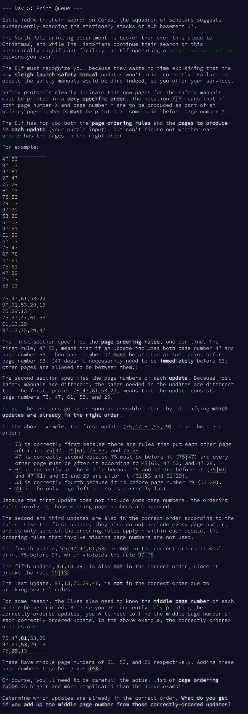
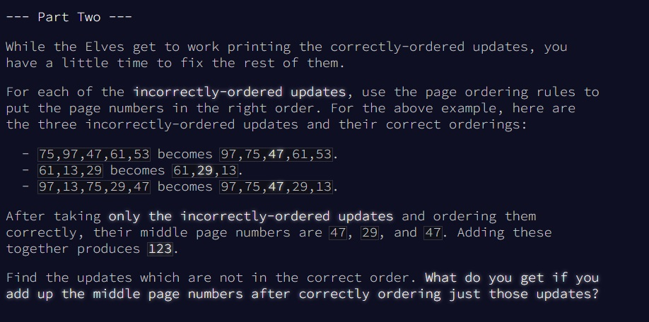

# Advent of Code - puzzle 4

Le puzzle se trouve en ligne [ici](https://adventofcode.com/2024/day/5).

## Question 1


<br>
<br>

## Difficultés rencontrées

1. Question 1 : Pas de grosse difficulté. Il fallait faire un peu de data ing pour récupérer les données et bien les séparer. Pour ce qui est de répondre à la question, il fallait surtout penser au problème à l'envers : repérer les lignes avec au moins une transgression de règle est plus facile que de repérer les lignes qui respectent toutes les règles. Une fois repéré, il n'y a pas de difficulté à finir le calcul
2. Question 2 :  bien plus compliqué. Je suis mal parti en essayant de créer une liste unique des règles. Cette liste aurait dû contenir toutes les règles. Par exemple, au lieu d'avoir les 3 règles suivantes : 13|24, 13|67 et 24|67, cela aurait donné la règle 13|24|67. Avec cette règle unique pour tout les orders, j'aurai pu déterminer l'élément central très facilement. Mais je me suis cassé les dents sans réussir à faire cela, en tout cas sans utiliser d'itération ! Du coup je suis revenu en arrière pour penser à une solution différente, et j'ai fini par appliquer le code ci-dessous, c'est à dire repérer toutes les règles utilisées pour chaque ligne et faire des comptage sur ces règles pour trier les éléments. 
<br>

## Solution Question 1

Code en lien [ici](https://github.com/renoriwal/puzzles/tree/main/adventofcode_2024/puzzle_5/puzzle_5_question_1_solution_sql.sql).
<br> ou tout simplement ci-dessous :
```sql

with DATA_RANK as
-- on rajoute un rank pour pourvoir séparer les rules des orders 
(
select
     col_0 as ligne
    ,row_number() over () as rank
from PROJET.SCHEMA.PUZZLE_INPUT
)
,DATA_RULES as 
-- on filtre sur la première partie de l'input : il s'agit des règles que l'on appliquera sur les ordres (partie 2 du fichier)
-- on en profite pour séparer les règles en deux colonnes pour faciliter les calculs plus tard
(
select 
     ligne
    ,substring(ligne,1                 ,instr(ligne,'|')-1              ) as rules_1
    ,substring(ligne,instr(ligne,'|')+1,length(ligne) - instr(ligne,'|')) as rules_2
from DATA_RANK
where rank < (select rank from DATA_RANK where ligne is null) 
)
,DATA_ORDERS_ARRAY as 
-- on filtre sur la deuxièe partie du dataset, c'est à dire les orders. 
(
select 
     ligne
    ,split(ligne,',') as orders_array
from DATA_RANK
where rank > (select rank from DATA_RANK where ligne is null) 
)
,DATA_ORDERS as 
-- unnest des orders + rank pour pouvoir les travailler plus facilement. 
(
select 
    DATA_ORDERS_ARRAY.ligne
    ,ORDERS as orders
    ,row_number() over (partition by DATA_ORDERS_ARRAY.ligne) as rank
from DATA_ORDERS_ARRAY
join unnest (DATA_ORDERS_ARRAY.orders_array) as ORDERS
)
,DATA_ORDERS_ALL_COMBI as
-- depuis la tables des orders, on crée une table contenant toutes les combinaisons possibles en prenant les élément deux à deux. chaque élément sera vérifier dans les réègles par la suite.
(
select
     ORDER_1.ligne
    ,ORDER_1.orders as order_1
    ,ORDER_1.rank   as rank_1
    ,ORDER_2.orders as order_2
    ,ORDER_2.rank   as rank_2
from DATA_ORDERS as ORDER_1
join DATA_ORDERS as ORDER_2
    on  ORDER_1.ligne = ORDER_2.ligne
    and ORDER_1.rank  < ORDER_2.rank
)
,DATA_TRANSGRESSION as
-- on vient rajouter un tag sur chaque combinaison pour savoir si elle transgresse une des règles. 
-- pour cela, on vient vérifier si on retrouve au moins une règles écrite à l'envers (on inverse les coordonnées). Si c'est le cas, alors il ne faudrat pas prednre la ligne
(
select 
     ORDERS.ligne
    ,ORDERS.order_1
    ,ORDERS.rank_1
    ,ORDERS.order_2
    ,ORDERS.rank_2
    ,case when RULES.ligne is not null then 1 else 0 end as is_transgression
from DATA_ORDERS_ALL_COMBI ORDERS
left join DATA_RULES RULES
    on  ORDERS.order_1 = RULES.rules_2
    and ORDERS.order_2 = RULES.rules_1
)
,DATA_TRANSGRESSION_FILTRE as 
-- on rajoute 2 colonnes qui permettront de filtrer selon les règles du jeu : 
-- 1 - on le prend pas en compte les lignes qui contiennent une transgression
-- 2 - on sommera la valeur située au milieu de l'order
(
select
     ligne
    ,order_1
    ,rank_1
    ,order_2
    ,rank_2
    ,is_transgression
    ,max(is_transgression ) over (partition by ligne)        as ligne_avec_transagression -- 1 si la ligne contient une transagression
    ,(max(rank_1          ) over (partition by ligne) +2) /2 as filtre_rank -- numéro du rank du milieu de l'order
from DATA_TRANSGRESSION
)
,DATA_DISTINCT as 
(
-- on filtre grâce aux colones calculées précédemment et on rajoute un distinct pour ne prendre qu'une seule fois la valeur du milieu de l'order (en créant toutes les combinaison, on a créé des doublons)
select distinct
     ligne
    ,order_1 
from DATA_TRANSGRESSION_FILTRE
where true
    and ligne_avec_transagression = 0
    and filtre_rank = rank_1
)
select 
    sum(cast(order_1 as integer)) as reponse_puzzle_5_question_1
from DATA_DISTINCT
```


## Question 2


<br>


## Solution Question 2


Code en lien [ici](https://github.com/renoriwal/puzzles/tree/main/adventofcode_2024/puzzle_5/puzzle_5_question_2_solution_sql.sql).
<br> ou tout simplement ici : 
```sql

with DATA_RANK as
-- on rajoute un rank pour pourvoir séparer les rules des orders 
(
select
     col_0 as ligne
    ,row_number() over () as rank
from `lv-gcp-dcx-int-data4csc-ww.lv_bqd_int_dp_data4csc_working.RIOUALRE_SANDBOX_q5_sync_bq`
)
,DATA_RULES as 
-- on filtre sur la première partie de l'input : il s'agit des règles que l'on appliquera sur les ordres (partie 2 du fichier)
-- on en profite pour séparer les règles en deux colonnes pour faciliter les calculs plus tard
(
select 
     ligne
    ,substring(ligne,1                 ,instr(ligne,'|')-1              ) as rules_1
    ,substring(ligne,instr(ligne,'|')+1,length(ligne) - instr(ligne,'|')) as rules_2
from DATA_RANK
where rank < (select rank from DATA_RANK where ligne is null) 
)
,DATA_ORDERS_ARRAY as 
-- on filtre sur la deuxièe partie du dataset, c'est à dire les orders. 
(
select 
     ligne
    ,split(ligne,',') as orders_array
from DATA_RANK
where rank > (select rank from DATA_RANK where ligne is null) 
)
,DATA_ORDERS as 
-- unnest des orders + rank pour pouvoir les travailler plus facilement. 
(
select 
    DATA_ORDERS_ARRAY.ligne
    ,ORDERS as orders
    ,row_number() over (partition by DATA_ORDERS_ARRAY.ligne) as rank
from DATA_ORDERS_ARRAY
join unnest (DATA_ORDERS_ARRAY.orders_array) as ORDERS
)
,DATA_ORDERS_ALL_COMBI as
-- depuis la tables des orders, on crée une table contenant toutes les combinaisons possibles en prenant les élément deux à deux. chaque élément sera vérifier dans les réègles par la suite.
(
select
     ORDER_1.ligne
    ,ORDER_1.orders as order_1
    ,ORDER_1.rank   as rank_1
    ,ORDER_2.orders as order_2
    ,ORDER_2.rank   as rank_2
from DATA_ORDERS as ORDER_1
join DATA_ORDERS as ORDER_2
    on  ORDER_1.ligne = ORDER_2.ligne
    and ORDER_1.rank  < ORDER_2.rank
)
,DATA_TRANSGRESSION as
-- on vient rajouter un tag sur chaque combinaison pour savoir si elle transgresse une des règles. 
-- pour cela, on vient vérifier si on retrouve au moins une règles écrite à l'envers (on inverse les coordonnées). Si c'est le cas, alors il ne faudrat pas prednre la ligne
(
select 
     ORDERS.ligne
    ,ORDERS.order_1
    ,ORDERS.rank_1
    ,ORDERS.order_2
    ,ORDERS.rank_2
    ,case when RULES.ligne is not null then 1 else 0 end as is_transgression
from DATA_ORDERS_ALL_COMBI ORDERS
left join DATA_RULES RULES
    on  ORDERS.order_1 = RULES.rules_2
    and ORDERS.order_2 = RULES.rules_1
)
,DATA_TRANSGRESSION_FILTRE as 
-- on rajoute 2 colonnes qui permettront de filtrer selon les règles du jeu : 
-- 1 - on le prend pas en compte les lignes qui contiennent une transgression
-- 2 - on sommera la valeur située au milieu de l'order
(
select
     ligne
    ,order_1
    ,rank_1
    ,order_2
    ,rank_2
    ,is_transgression
    ,max(is_transgression ) over (partition by ligne)        as ligne_avec_transagression -- 1 si la ligne contient une transagression
    ,(max(rank_1          ) over (partition by ligne) +2) /2 as filtre_rank -- numéro du rank du milieu de l'order
from DATA_TRANSGRESSION
)
,RULES_ASSCOIATED as 
-- pour chaque ligne avec un transgression, et pour chaque croisement possible de règle, on vient associer la vraie règle
-- le but sera, une fois qu'on aura toutes les règles à appliquer pour une lignes, de compter le nombre d'appartition de chacun des premiers élément des règles. 
-- ainsi, l'élément qui apparaît le plus est le premier élément, celui qui apparaît une fois de moins est le deuxième élément... cela permettra de trier la ligne. 
(
select  
     ORDERS.ligne
    ,ORDERS.order_1
    ,ORDERS.order_2
    ,RULES.rules_1
    ,RULES.rules_2
from DATA_TRANSGRESSION_FILTRE ORDERS
left join DATA_RULES RULES
    on (ORDERS.order_1 = RULES.rules_1 and ORDERS.order_2 = RULES.rules_2)
       or
       (ORDERS.order_1 = RULES.rules_2 and ORDERS.order_2 = RULES.rules_1)
where true
    and ligne_avec_transagression = 1 -- on filtre sur les lignes avec une transgression pour les retravailler
)
,RULES_ASSCOIATED_COUNT as
-- on compte le nombre de fois qu'apparaît la premier élément de la règle à appliquer
(
select 
     ligne
    ,rules_1
    ,count(*) as nb_apparition
from RULES_ASSCOIATED
group by all
)
,RULES_ASSCOIATED_FILTER as
-- on rajoute un calcul pour filtrer sur l'élément central de la ligne
(
select 
     ligne
    ,rules_1
    ,nb_apparition
    ,max(nb_apparition) over (partition by ligne)/2 as filter
from RULES_ASSCOIATED_COUNT
)
-- on filtre sur l'élément central et on somme
select 
     sum(cast(rules_1 as integer)) as reponse_puzzle_5_question_2
from RULES_ASSCOIATED_FILTER
where true
    and filter = nb_apparition -- filtre sur la valeur du milieu de la série une fois triée. 
```