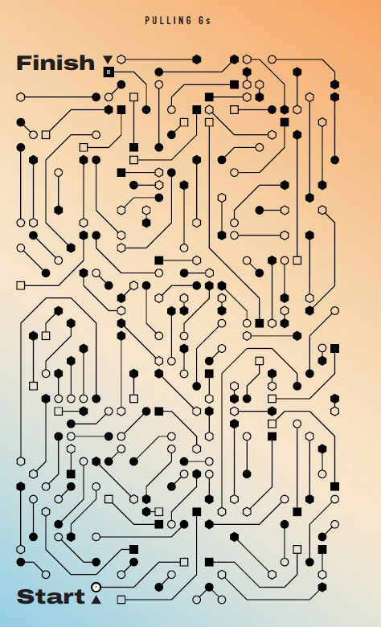

# Labyrinthe géo

## Puzzle



## Règles

Dans ce labyrinthe, vous devez parcourir les lignes en sautant de figures géométriques vers d'autres figures géométriques. Vous commencez au rond blanc à côté du **START** pour finir au crré noir à côté du **FINISH** en respectant les règles suivantes : <br>
- Vous suivez la ligne continue <br>
- Vous arrivez à une figure géométrique (rond / carré / héxagone) vide (ou transparente) <br>
- Vous devez sauter vers une autre figure identique pleine (ou noire) <br>
- Vous recommencez en suivant la ligne que vous venez d'atteindre <br>
- Attention, lorsque vous sautez d'une figure vide à une figure pleine, vous devez respecter les deux règles suivantes :  <br>
    - Vous ne pouvez effectuer un saut que horizontalement ou verticalement. Pas de diagonale <br>
    - Vous devez obligatoirement sautez par dessus une ligne continue <br>

## Difficultés rencontrées

2 difficultés dans ce puzzle : <br>
- Savoir comment s'y prendre pour le résoudre car on part d'une image. Il faut donc imaginer comment transformer tout ça en base de données requêtable. 
- résoudre le puzzle en lui-même car c'est la première fois que j'utilisais des fonction géo en SQL. Rien de fou au final mais je suis tomber plusieurs fois dans des pièges.


## Solution : création de la table des données du jeu

Pour résoudre le puzzle, il faut bien sur le transformer en data. Ici, on va récupérer les coordonées de toutes les lignes (qui sont des suites de segments). Il faut noter également si le segment est viable ou non car certains d'entre eux ne sont pas utilisables pour sauter d'un point A à un point B, mais il sont utilisable car on peut sauter par dessus !

Le code se trouve [ici](https://github.com/renoriwal/puzzles/blob/main/jeux_et_enigme_visuels/labyrinthe_geo/labyrinthe_geo_data_init.sql) <br>
Voici les 15 premières lignes en exemple : <br>
```sql

create or replace table  `lv-gcp-dcx-int-data4csc-ww`.`lv_bqd_int_dp_data4csc_working`.data_geo as 
select st_geogfromtext('multilinestring(( 6  1, 9  1,11  3,13  3            ))') as path, 'R' as start_form, 'C' as end_form, 1 as is_line_ok union all
select st_geogfromtext('multilinestring((11  1,12  2                        ))') as path, 'R' as start_form, 'R' as end_form, 1 as is_line_ok union all
select st_geogfromtext('multilinestring(( 9  3, 8  2                        ))') as path, 'R' as start_form, 'R' as end_form, 1 as is_line_ok union all
select st_geogfromtext('multilinestring((14  7,14  2,12  0, 8  0            ))') as path, 'C' as start_form, 'C' as end_form, 1 as is_line_ok union all
select st_geogfromtext('multilinestring((24  1,23  0,18  0,16  2            ))') as path, 'H' as start_form, 'H' as end_form, 1 as is_line_ok union all
select st_geogfromtext('multilinestring(( 9  4, 8  4, 6  2, 4  2, 2  4, 2  7))') as path, 'C' as start_form, 'H' as end_form, 1 as is_line_ok union all
select st_geogfromtext('multilinestring(( 6  3, 5  3, 3  5                  ))') as path, 'R' as start_form, 'R' as end_form, 1 as is_line_ok union all
select st_geogfromtext('multilinestring(( 0  3, 1  3, 2  2                  ))') as path, 'R' as start_form, 'R' as end_form, 1 as is_line_ok union all
select st_geogfromtext('multilinestring(( 0  9, 0  4                        ))') as path, 'H' as start_form, 'H' as end_form, 1 as is_line_ok union all
select st_geogfromtext('multilinestring(( 1  5, 1  8                        ))') as path, 'R' as start_form, 'R' as end_form, 1 as is_line_ok union all
select st_geogfromtext('multilinestring((15  3,17  3,19  1,21  1,22  2,22  4))') as path, 'C' as start_form, 'C' as end_form, 1 as is_line_ok union all
select st_geogfromtext('multilinestring((17  5,20  2                        ))') as path, 'H' as start_form, 'H' as end_form, 1 as is_line_ok union all
select st_geogfromtext('multilinestring((21  6,21  3                        ))') as path, 'R' as start_form, 'R' as end_form, 1 as is_line_ok union all
```

## Solution : création de la table des sauts possibles 

Pour respecter la règle qui consiste à sauter d'une figure pleine (carré / rond / hexagone) à la même figure vide et en sautant par dessus une ligne, on crée une table qui contient tous les sauts autorisés. Cela évite de la recalculer à chaque fois. 

le code se trouve [là](https://github.com/renoriwal/puzzles/blob/main/jeux_et_enigme_visuels/labyrinthe_geo/labyrinthe_geo_sauts_possibles.sql) <br>

ce qui donne ceci : 
```sql
-- création de la table contenant tous les sauts possibles selon les règles du jeu
create or replace table `lv-gcp-dcx-int-data4csc-ww`.`lv_bqd_int_dp_data4csc_working`.data_geo_croisement as
-- première partie : on prend les intersection qui valent un point (mais pas le point de début ou fin de ligne)
select 
     -- on stock le point de départ et d'arrivée du saut
     st_endpoint(p.path) as end_point_previous
    ,st_startpoint(n.path) as start_point_next
from `lv-gcp-dcx-int-data4csc-ww`.`lv_bqd_int_dp_data4csc_working`.data_geo as p -- point de départ du saut
join `lv-gcp-dcx-int-data4csc-ww`.`lv_bqd_int_dp_data4csc_working`.data_geo as n -- point d'arrivée du saut
    on  (round(st_x(st_endpoint(p.path))) = round(st_x(st_startpoint(n.path))) or round(st_y(st_endpoint(p.path))) = round(st_y(st_startpoint(n.path))))
    and p.end_form = n.start_form 
    and st_astext(p.path) <> st_astext(n.path)
cross join `lv-gcp-dcx-int-data4csc-ww`.`lv_bqd_int_dp_data4csc_working`.data_geo as c -- jointure sur toutes les autres lignes du puzzle
where  
    -- on veut au moins un croisement
    st_intersects(st_makeline([st_endpoint(p.path),st_startpoint(n.path)]),c.path)
    -- les points pour la ligne de saut sont sur des lignes cohérentes
    and p.is_line_ok = 1
    and n.is_line_ok = 1
    -- on veux que le croisement soit un point pour appliquer les règles ci-dessous
    and st_geometrytype(st_intersection(st_makeline([st_endpoint(p.path),st_startpoint(n.path)]),c.path)) = 'ST_Point' 
    -- on enlève les ligne qui sont cross join avec elle même
    and st_astext(st_endpoint(p.path  )) <> st_astext(st_endpoint(  c.path)) 
    and st_astext(st_startpoint(n.path)) <> st_astext(st_startpoint(c.path)) 
    -- on enlève les points qui commencent ou terminent une ligne. on souhaite que deux lignes se coupent en plein milieu
    -- le start point pour commencer
    and (
         round(st_x(st_intersection(st_makeline([st_endpoint(p.path),st_startpoint(n.path)]),c.path))) <> round(st_x(st_startpoint(c.path))) 
         OR
         round(st_y(st_intersection(st_makeline([st_endpoint(p.path),st_startpoint(n.path)]),c.path))) <> round(st_y(st_startpoint(c.path)))
        )
    -- puis le end point
    and (
         round(st_x(st_intersection(st_makeline([st_endpoint(p.path),st_startpoint(n.path)]),c.path))) <> round(st_x(st_endpoint(c.path))) 
         OR
         round(st_y(st_intersection(st_makeline([st_endpoint(p.path),st_startpoint(n.path)]),c.path))) <> round(st_y(st_endpoint(c.path)))
        )
union all
-- deuxième partie : on prend toutes les intersections qui valent plus qu'un point
select 
     -- on stock le point de départ et d'arrivée du saut
     st_endpoint(p.path) as end_point_previous
    ,st_startpoint(n.path) as start_point_next
from `lv-gcp-dcx-int-data4csc-ww`.`lv_bqd_int_dp_data4csc_working`.data_geo as p -- point de départ du saut
join `lv-gcp-dcx-int-data4csc-ww`.`lv_bqd_int_dp_data4csc_working`.data_geo as n -- point d'arrivée du saut
    on  (round(st_x(st_endpoint(p.path))) = round(st_x(st_startpoint(n.path))) or round(st_y(st_endpoint(p.path))) = round(st_y(st_startpoint(n.path))))
    and p.end_form = n.start_form 
    and st_astext(p.path) <> st_astext(n.path)
cross join `lv-gcp-dcx-int-data4csc-ww`.`lv_bqd_int_dp_data4csc_working`.data_geo as c -- jointure sur toutes les autres lignes du puzzle
where  
    -- on veut au moins un croisement
    st_intersects(st_makeline([st_endpoint(p.path),st_startpoint(n.path)]),c.path)
    -- les points pour la ligne de saut sont sur des lignes cohérentes
    and p.is_line_ok = 1
    and n.is_line_ok = 1
    -- on veux que le croisement soit un point pour appliquer les règles ci-dessous
    and st_geometrytype(st_intersection(st_makeline([st_endpoint(p.path),st_startpoint(n.path)]),c.path)) <> 'ST_Point' 
    -- on enlève les ligne qui sont cross join avec elle même
    and st_astext(st_endpoint(p.path  )) <> st_astext(st_endpoint(  c.path)) 
    and st_astext(st_startpoint(n.path)) <> st_astext(st_startpoint(c.path)) 
```


## Solution : résolution du puzzle 

Maintenant qu'on a tout sous la main, il ne reste qu'à résoudre le problème. Pour cela on fait une boucle qui rajoute un point sur la solution possible. On s'arrête lorsque la solution contient le point **FINISH**

Le code est dispo [là](https://github.com/renoriwal/puzzles/blob/main/jeux_et_enigme_visuels/labyrinthe_geo/labyrinthe_geo_resolution.sql) ou là :  <br>

```sql
declare current_iteration INT64 default 0;

-- initialisation de la solution du puzzle
create or replace table `lv-gcp-dcx-int-data4csc-ww`.`lv_bqd_int_dp_data4csc_working`.requete_geo_solution as
select st_geogpoint( 6,  1) as start_point, st_geogpoint( 7, 42) as end_point, st_astext(st_geogpoint(15,  3)) as solution;

repeat
  set current_iteration = current_iteration + 1;

create or replace table `lv-gcp-dcx-int-data4csc-ww`.`lv_bqd_int_dp_data4csc_working`.requete_geo_solution_temp as
-- boucle sur les chemins faisables
select 
     --n.start_point, st_startpoint(p.path), st_endpoint(p.path), p.path, p.end_form, n.path, 'n', n.*
      st_startpoint(n.path) as start_point
     ,s.end_point
     ,concat(s.solution,', ', st_astext(st_startpoint(n.path))) as solution
from `lv-gcp-dcx-int-data4csc-ww`.`lv_bqd_int_dp_data4csc_working`.requete_geo_solution s -- start
-- récupération du point end of path
join `lv-gcp-dcx-int-data4csc-ww`.`lv_bqd_int_dp_data4csc_working`.data_geo p -- preceding
    on  st_x(s.start_point) = st_x(st_startpoint(p.path))
    and st_y(s.start_point) = st_y(st_startpoint(p.path))
-- jointure pour récupérer le start of path suivant. plusieurs chemins possibles. 
join `lv-gcp-dcx-int-data4csc-ww`.`lv_bqd_int_dp_data4csc_working`.data_geo n -- next
    on  (round(st_x(st_endpoint(p.path))) = round(st_x(st_startpoint(n.path))) OR round(st_y(st_endpoint(p.path))) = round(st_y(st_startpoint(n.path))))
    and p.end_form = n.start_form 
    -- on retire les chemins déjà utilisés
    and NOT (REGEXP_CONTAINS(s.solution,st_astext(st_startpoint(n.path))))
    -- on ne prend que les lignes valides
    and p.is_line_ok = 1
-- on filtre sur les règles du jeu
where exists (select 1
                from `lv-gcp-dcx-int-data4csc-ww`.`lv_bqd_int_dp_data4csc_working`.data_geo_croisement c -- croisement
                where   st_astext(c.end_point_previous) = st_astext(st_endpoint(p.path)) 
                    and st_astext(c.start_point_next  ) = st_astext(st_startpoint(n.path)) 
             );

drop table `lv-gcp-dcx-int-data4csc-ww`.`lv_bqd_int_dp_data4csc_working`.requete_geo_solution;

create or replace table `lv-gcp-dcx-int-data4csc-ww`.`lv_bqd_int_dp_data4csc_working`.requete_geo_solution as
select * from `lv-gcp-dcx-int-data4csc-ww`.`lv_bqd_int_dp_data4csc_working`.requete_geo_solution_temp;

drop table `lv-gcp-dcx-int-data4csc-ww`.`lv_bqd_int_dp_data4csc_working`.requete_geo_solution_temp;

  UNTIL current_iteration = 30 or exists (select 1 from `lv-gcp-dcx-int-data4csc-ww`.`lv_bqd_int_dp_data4csc_working`.requete_geo_solution where solution like'%(7,42)%')
end repeat;


select * from `lv-gcp-dcx-int-data4csc-ww`.`lv_bqd_int_dp_data4csc_working`.requete_geo_solution;
```


## Solution : résultat

Avoir avoir fait une boucle infinie et obtenue une erreur de mémoire... j'obtiens bien le résultat souhaité. Et si on change un peu la condition d'arrêt de la boucle pour aller plus loin et chercher plus de solution, au final, on trouve beaucoup de possibilité pour résoudre ce puzzle. Je me suis arrêté après avoir obtenu plus de 8 millions de chemins possible pour arriver au **FINISH**. 

Voici la solution optimale : 


et voici quelques autres solutions prises au hasard dans les 8 millions de possibilité